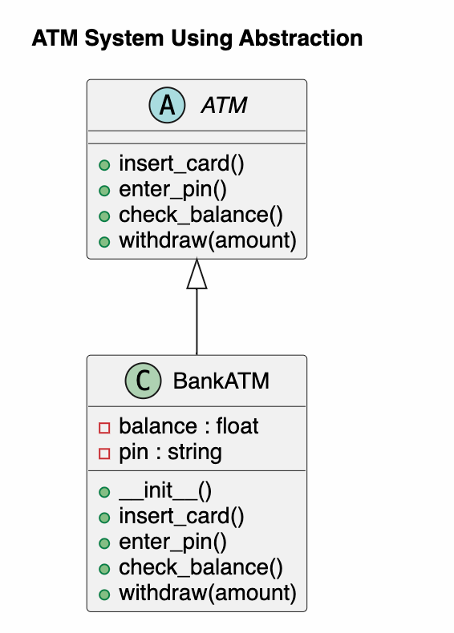

# ATM System Using Abstraction

## Project Overview

This project demonstrates the concept of **Abstraction** in Python.

An ATM provides several operations for customers:

- Insert Card
- Enter PIN
- Check Balance
- Withdraw Money

The customer only uses these operations and does not know the internal implementation.

The project uses an **abstract class** named `ATM` and a subclass named `BankATM`.

---

# Class Diagram



The class diagram contains two classes.

- **ATM** is an abstract class.
- **BankATM** inherits from ATM.
- BankATM implements all abstract methods.

---

# Project Structure

```
ATMSystem/
│
├── main.py
├── classDiagram.png
├── classDiagram.puml
└── README.md
```

---

# Classes

## ATM

The abstract class defines the operations that every ATM must provide.

Abstract methods:

- insert_card()
- enter_pin()
- check_balance()
- withdraw(amount)

---

## BankATM

BankATM inherits from ATM.

It implements all abstract methods.

It stores:

- balance
- PIN
- login status

---

# Abstraction

Abstraction means **showing only the necessary operations while hiding the implementation details**.

The customer only knows:

- Insert Card
- Enter PIN
- Check Balance
- Withdraw Money

The customer does not know:

- How the PIN is verified.
- How the balance is stored.
- How the withdrawal is processed.

These internal details are hidden inside the BankATM class.

---

# Program Flow

```
Start
    │
    ▼
Create BankATM Object
    │
    ▼
Display Menu
    │
    ▼
User Selects Operation
    │
    ▼
Call ATM Method
    │
    ▼
BankATM Executes Operation
    │
    ▼
Display Result
    │
    ▼
Repeat or Exit
```

---

# Sample Output

```
==============================
 ATM System
==============================

1. Insert Card
2. Enter PIN
3. Check Balance
4. Withdraw Money
0. Exit

Choose: 1

Card inserted successfully.

Choose: 2

Enter PIN:
1234

PIN verified.

Choose: 3

Current Balance : $5000

Choose: 4

Withdraw Amount:
500

500 withdrawn successfully.

Remaining Balance : 4500
```

---

# Python Concepts Used

This project uses:

- Object-Oriented Programming (OOP)
- Abstract Class
- Abstract Method
- Inheritance
- Method Implementation
- Constructor
- CLI Menu

---

# Learning Summary

This project helped me understand the concept of **Abstraction** in Python.

The abstract class defines the required methods but does not provide their implementation.

The BankATM class inherits from the abstract class and implements all required methods.

Abstraction hides the internal implementation and only exposes the necessary operations to the user.

---

# Author

Richard Xiahou

MSE800 – Object-Oriented Programming

Yoobee College