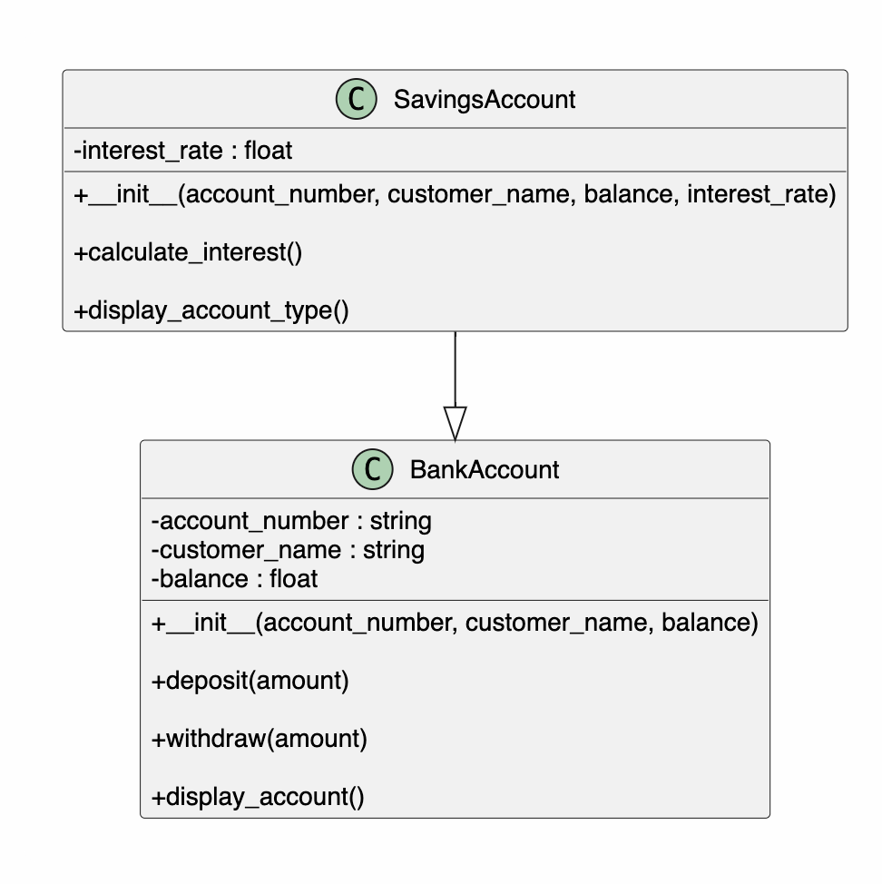

# Bank Account Management System

## Overview

This project is a simple Bank Account Management System developed using Python classes and single inheritance.

The project demonstrates the basic concepts of Object-Oriented Programming (OOP), including classes, objects, constructors, methods, and inheritance.

---

# Project Structure

```
BankSystem/

├── BankAccount.py
├── SavingsAccount.py
├── main.py
├── README.md
└── classDiagram.png
```

---

# Class Diagram

The following class diagram shows the relationship between the two classes.



The `SavingsAccount` class inherits from the `BankAccount` class.

---

# Features

The system supports the following operations.

- Display account information
- Deposit money
- Withdraw money
- Prevent withdrawing more than the current balance
- Display account type
- Calculate interest for a savings account

---

# OOP Design

## BankAccount

The `BankAccount` class stores common account information.

Attributes:

- account_number
- customer_name
- balance

Methods:

- display_account()
- deposit()
- withdraw()

---

## SavingsAccount

The `SavingsAccount` class inherits from `BankAccount`.

Additional attribute:

- interest_rate

Additional methods:

- display_account_type()
- calculate_interest()

---

# Sample Scenario

Customer:

John

Account Number:

SA1001

Initial Balance:

$5000

Operations:

- Deposit $1000
- Withdraw $500
- Calculate interest (5%)

---

# Learning Outcomes

After completing this project, I learned:

- Python Classes
- Constructors
- Object-Oriented Programming
- Single Inheritance
- The use of `super()`
- Code Reuse
- CLI Menu Programming

---

# Author

Richard Xiahou

Master of Software Engineering

Yoobee Colleges