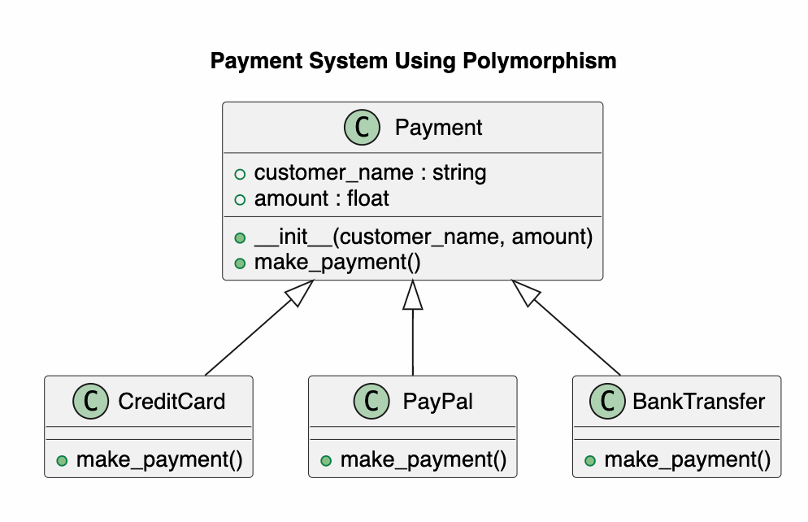

# Payment System Using Polymorphism

## Project Overview

This project demonstrates **Polymorphism** in Python using a simple payment system.

Customers can make payments using different payment methods:

- Credit Card
- PayPal
- Bank Transfer

Although each payment method is different, they all use the same method:

```python
make_payment()
```

Each subclass implements its own payment process.

---

# Class Diagram



The class diagram shows one parent class and three child classes.

- **Payment** is the parent class.
- **CreditCard**, **PayPal**, and **BankTransfer** inherit from the Payment class.
- Each child class overrides the `make_payment()` method.

This is an example of **Polymorphism**.

---

# Project Structure

```
PaymentSystem/
│
├── Payment.py
├── CreditCard.py
├── PayPal.py
├── BankTransfer.py
├── main.py
├── classDiagram.png
└── README.md
```

---

# Classes

## Payment

The parent class.

### Attributes

- customer_name
- amount

### Method

- make_payment()

---

## CreditCard

Inherits from **Payment**.

Overrides:

```python
make_payment()
```

Displays the payment information for Credit Card.

---

## PayPal

Inherits from **Payment**.

Overrides:

```python
make_payment()
```

Displays the payment information for PayPal.

---

## BankTransfer

Inherits from **Payment**.

Overrides:

```python
make_payment()
```

Displays the payment information for Bank Transfer.

---

# Polymorphism

Polymorphism means **one interface, many implementations**.

All payment objects have the same method:

```python
make_payment()
```

However, each class performs the payment differently.

Example:

```python
payment = CreditCard("Richard", 100)
payment.make_payment()
```

Output:

```
Credit Card payment successful.
```

Another example:

```python
payment = PayPal("Richard", 100)
payment.make_payment()
```

Output:

```
PayPal payment successful.
```

Although the method name is the same, the result is different.

This is called **Method Overriding**, which is one form of **Polymorphism**.

---

# Program Flow

```
Start
   │
   ▼
Display Menu
   │
   ▼
Choose Payment Method
   │
   ▼
Create Object
   │
   ▼
Call make_payment()
   │
   ▼
Execute Child Class Method
   │
   ▼
Display Result
   │
   ▼
End
```

---

# Sample Output

```
===============================
 Payment System
===============================

1. Credit Card
2. PayPal
3. Bank Transfer
0. Exit

Choose: 2

Customer Name: Richard
Amount: 350

========== PayPal ==========
Customer : Richard
Amount   : $350
Payment Method : PayPal
PayPal payment successful.
```

---

# Python Concepts Used

This project uses the following Python concepts:

- Class
- Object
- Constructor (`__init__`)
- Inheritance
- Method Overriding
- Polymorphism
- `super()`
- CLI Menu

---

# Learning Summary

In this project, I learned how to use **Polymorphism** in Python.

A parent class defines a common method, while different child classes provide their own implementation.

This allows the program to call the same method (`make_payment()`) for different objects and automatically execute the correct payment process.

Polymorphism makes programs easier to maintain, extend, and reuse.

---

# Author

Richard Xiahou

MSE800 – Object-Oriented Programming

Yoobee College