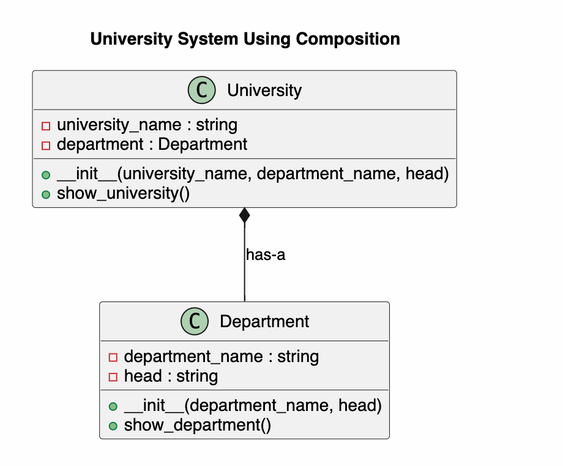

# University System Using Composition
 Composition 这里可以理解为复合, 例如， 复合函数 function composition

## Project Overview

This project demonstrates the concept of **Composition** in Python Object-Oriented Programming.

A university has one or more departments.

Instead of using inheritance, the `University` class contains a `Department` object.

This relationship is called **Composition**.

---

# Class Diagram



The class diagram contains two classes.

- Department
- University

The University class creates and owns a Department object.

This is a **has-a** relationship.

```
University has a Department
```

Composition is represented in UML using a **filled diamond**.

---

# Project Structure

```
UniversitySystem/
│
├── main.py
├── classDiagram.puml
├── classDiagram.png
└── README.md
```

---

# Classes

## Department

The Department class stores department information.

### Attributes

- department_name
- head

### Method

- show_department()

---

## University

The University class stores university information.

### Attributes

- university_name
- department

The department object is created inside the constructor.

### Method

- show_university()

---

# Composition

Composition means one class contains an object of another class.

```
University
    │
    │ has-a
    ▼
Department
```

The University object creates and owns a Department object.

When the University object is used, it can also access the Department information.

Unlike inheritance,

```
University is NOT a Department.
```

Instead,

```
University HAS a Department.
```

---

# Program Flow

```
Start
    │
    ▼
Display Menu
    │
    ▼
Create University
    │
    ▼
Create Department Object
    │
    ▼
Store Department inside University
    │
    ▼
Display University Information
    │
    ▼
Display Department Information
    │
    ▼
Exit
```

---

# Sample Output

```
==============================
 University System
==============================

1. Create University
2. Display Information
0. Exit

Choose: 1

University Name:
Yoobee College

Department Name:
Software Engineering

Head of Department:
Dr Smith

University created successfully.

Choose: 2

==============================
University Information
==============================

University : Yoobee College
Department Name : Software Engineering
Head of Department : Dr Smith
```

---

# Python Concepts Used

This project demonstrates:

- Class
- Object
- Constructor (`__init__`)
- Composition
- Object Creation
- Method Calling
- CLI Menu

---

# Learning Summary

This project helped me understand **Composition** in Python.

The `University` class creates and contains a `Department` object.

This relationship is called **has-a**, because a university has a department.

Composition is different from inheritance.

Inheritance describes an **is-a** relationship.

Composition describes a **has-a** relationship.

---

# Author

Richard Xiahou

MSE800 – Object-Oriented Programming

Yoobee College